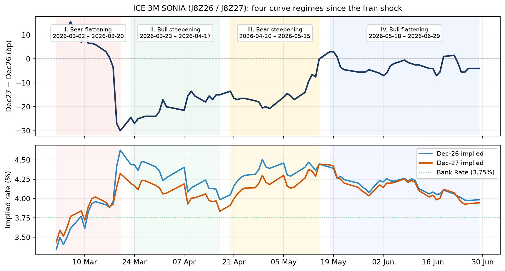

# Dec27−Dec26 on ICE 3M SONIA: four curve regimes since the Iran shock

*ICE 3M SONIA futures **J8Z26 / J8Z27** (Barchart EOD), 2 Mar – 29 Jun 2026.*

After the Iran shock the Dec27−Dec26 belly did not move in one direction. It cycled through **four separable regimes**. In each one the question is not just which way rates moved, but whether you were better off **outright** on the level trend or **curved** — and whether the curve expression **hedged you on hawkish days** when the outright leg would have been hit.

---

## Setup

| Item | Detail |
|---|---|
| **Contracts** | J8Z26 (Dec-26), J8Z27 (Dec-27) |
| **Spread** | \(S_t = r_{\text{Dec27}} - r_{\text{Dec26}}\) (bp) |
| **Sample** | 2 Mar 2026 → 29 Jun 2026 |

**Overall phase type** — cumulative leg moves, start to close (ε = 0.5 bp on spread).

**Daily curve type** — session-by-session steepening / flattening / mixed / unchanged (ε = 0.25 bp).

**Hawk / dov / neutral** — trimmed μ̃ and σ̃ of daily ΔDec26 (10% dropped from each tail; 66 of 82 sessions):

| | |
|---|---:|
| **Hawk** | ΔDec26 **> +9.3 bp** |
| **Dov** | ΔDec26 **< −7.8 bp** |
| **Neutral** | between |

**Benchmarks per phase:**

| Level move | Outright expression | Curve expression |
|---|---|---|
| **Bear** (rates net higher) | Short Dec-26 | Depends on phase shape (below) |
| **Bull** (rates net lower) | Long Dec-26 | Depends on phase shape (below) |

For each phase we report: hawk/dov/neutral day shares, the **curve type on those days**, and whether the aligned curve structure **hedges** the outright on hawkish sessions.

---

## Four phases

| Phase | Window | Spread (bp) | **Overall type** | Level |
|---|---|---:|---|---|
| **I** | 2 Mar – 20 Mar | +9.5 → −30.0 | Bear flattening | **Bear** |
| **II** | 23 Mar – 17 Apr | −24.5 → −15.0 | Bull steepening | **Bull** |
| **III** | 20 Apr – 15 May | −13.5 → 0.0 | Bear steepening | **Bear** |
| **IV** | 18 May – 29 Jun | +3.0 → −3.5 | Bull flattening | **Bull** |

---

## Phase I — Bear flattening (bear level move)

**Net:** Dec-26 **+128 bp**, Dec-27 **+89 bp**. Rates up; front runs → spread inverts to **−30 bp**.

| Expression | Structure |
|---|---|
| Outright | **Short Dec-26** |
| Curve | **Flattener** (L Dec26 / S Dec27) — aligned with bear-flattening |

### Day mix

| | n | Share |
|---|---:|---:|
| Hawk | 9 | **60%** |
| Neutral | 4 | 27% |
| Dov | 2 | 13% |

### Curve type on hawk / dov / neutral days

| Day type | n | Steepening | Flattening | Modal type |
|---|---:|---:|---:|---|
| **Hawk** | 9 | 22% | **67%** | Bear flattening **67%** |
| Dov | 2 | 100% | 0% | Bull steepening 100% |
| Neutral | 4 | 0% | 100% | Bear / bull flat 50% each |

On **hawk days** — 60% of the phase — the curve does what the flattener needs: **two-thirds bear-flatten**. The outright short wins big on these days (avg **+18.7 bp**/session) but with full front-end vol. The flattener still earns (avg **+4.4 bp**) on the same days, participating in the bear move with the belly as a partial offset.

On **dov days** (relief rallies, 13%) the flattener loses: bull-steepening 100%. That is the cost of the hedge — you give up the dov tail to the steepener.

**Hedge verdict:** In a bear-flattening crisis, the flattener is aligned with the dominant hawk-day path. You sacrifice dov-day rallies; the outright short captures everything but at higher vol.

---

## Phase II — Bull steepening (bull level move)

**Net:** Dec-26 **−45.5 bp**, Dec-27 **−36 bp**. Rates down; spread recovers from deep inversion.

| Expression | Structure |
|---|---|
| Outright | **Long Dec-26** |
| Curve | **Steepener** (L Dec27 / S Dec26) — aligned with bull-steepening |

### Day mix

| | n | Share |
|---|---:|---:|
| Hawk | 2 | 11% |
| Neutral | 11 | 61% |
| Dov | 5 | **28%** |

### Curve type on hawk / dov / neutral days

| Day type | n | Any steepening | Flattening | Modal type |
|---|---:|---:|---:|---|
| **Hawk** | 2 | **50%** | 50% | Bear steep / bear flat |
| Dov | 5 | **80%** | 0% | Bull steepening **80%** |
| Neutral | 11 | 45% | 45% | Mixed |

This is the clearest hedge case. On **hawk days** the outright long is hit hard (avg **−12.5 bp**/session — Dec-26 spikes). But the steepener is nearly flat (avg **−0.5 bp**): on one hawk day the curve **still steepens** — bear steepening, a different kind — and the steepener earns **+0.5 bp** while the outright loses −11.5 bp. On the other hawk day it bear-flattens and the steepener loses only −1.5 bp vs −13.5 bp outright.

**50% of hawk days steepen** even in a bull phase. That is the hedge: you are long the bull trend through the curve, and hawkish shocks that crush an outright long often still widen the spread.

On **dov days** (28%) bull-steepening dominates (80%) — the steepener earns (avg **+3.8 bp**) alongside the outright (avg **+17.6 bp**), but with far less vol.

**Hedge verdict:** Bull via steepener. Hawk days hurt the outright; the curve expression absorbs the shock because steepening — bull or bear — is still your friend.

---

## Phase III — Bear steepening (bear level move)

**Net:** Dec-26 **+39.5 bp**, Dec-27 **+53 bp**. Rates up again; belly leads → spread to **flat**.

| Expression | Structure |
|---|---|
| Outright | **Short Dec-26** |
| Curve | **Steepener** (L Dec27 / S Dec26) — aligned with bear-steepening |

### Day mix

| | n | Share |
|---|---:|---:|
| Hawk | 2 | 11% |
| Neutral | 15 | **79%** |
| Dov | 2 | 11% |

### Curve type on hawk / dov / neutral days

| Day type | n | Steepening | Flattening | Modal type |
|---|---:|---:|---:|---|
| **Hawk** | 2 | 0% | **100%** | Bear flattening **100%** |
| Dov | 2 | **100%** | 0% | Bull steepening 100% |
| Neutral | 15 | **47%** | 47% | Bear steepening **40%** |

Hawk days are rare (11%) and here they **do not** hedge the steepener — both hawk sessions bear-flatten (outright short **+12.3 bp** avg, steepener **−2.8 bp** avg). The steepener's value is not on hawk tails in this phase.

It earns on **neutral days** (79% of the phase) where bear-steepening is modal (40%): the belly reprices hawkishly relative to the front without a Dec-26 tail event. Dov days (11%) are pure bull-steep — also steepener-friendly.

**Hedge verdict:** Bear via steepener works on the **neutral-day grind**, not on hawk shocks. The outright short wins on hawk days; the steepener wins on the slow bear-steep path that defines the phase.

---

## Phase IV — Bull flattening (bull level move)

**Net:** Dec-26 **−42 bp**, Dec-27 **−49 bp**. Rates down; belly compresses on the way.

| Expression | Structure |
|---|---|
| Outright | **Long Dec-26** |
| Curve | **Flattener** (L Dec26 / S Dec27) — aligned with bull-flattening |

### Day mix

| | n | Share |
|---|---:|---:|
| Hawk | 1 | 3% |
| Neutral | 27 | **90%** |
| Dov | 2 | 7% |

### Curve type on hawk / dov / neutral days

| Day type | n | Steepening | Flattening | Modal type |
|---|---:|---:|---:|---|
| **Hawk** | 1 | 0% | **100%** | Bear flattening **100%** |
| Dov | 2 | 0% | 50% | Bull flattening 50% |
| Neutral | 27 | 41% | **41%** | Bull flattening **33%** |

One hawk day (3%): Dec-26 spikes +15.5 bp. Outright long loses **−15.5 bp**; the flattener earns **+1.5 bp** — bear-flattening on a hawk day is exactly what the flattener needs. The belly does not participate in the spike; the front outperforms on the way up and the flattener captures the compression.

On **neutral days** (90%) bull-flattening is modal (33%) — the belly outperforms on the grind lower. The steepener would fight this; the flattener is aligned.

**Hedge verdict:** Bull via flattener. Hawk days are rare but the curve inverts the outright hit. The phase is defined by neutral-day bull-flattening, not tail events.

---

## Synthesis

| Phase | Level | Outright | Curve | Hawk-day hedge? |
|---|---|---|---|---|
| **I** Bear flat | Bear | Short Dec-26 | Flattener | **Yes** — 67% of hawk days bear-flatten; flattener earns on hawks |
| **II** Bull steep | Bull | Long Dec-26 | Steepener | **Yes** — 50% of hawk days still steepen; steepener near-flat vs outright −12.5 bp |
| **III** Bear steep | Bear | Short Dec-26 | Steepener | **No on hawks** — hawk days bear-flat; steepener earns on neutral grind |
| **IV** Bull flat | Bull | Long Dec-26 | Flattener | **Yes** — hawk day bear-flattens; flattener +1.5 bp vs outright −15.5 bp |

The pattern: **match the curve to the phase shape, not just the level direction.**

- Bull + steepening (II) → steepener hedges hawk days because steepening — even bear steepening — offsets the outright hit.
- Bull + flattening (IV) → flattener hedges hawk days because bear-flattening on a spike is flattener P&L.
- Bear + flattening (I) → flattener rides hawk-day bear-flats; pays away dov rallies.
- Bear + steepening (III) → steepener works on the neutral-day bear-steep grind; outright short wins hawk tails.

Outright (short in bear, long in bull) always captures the level trend with full vol. The curve earns its keep when hawk-day proportions show the **aligned curve type** still firing on the days that would hurt the outright.

---

*Rebuild: `python3 build_dec27_dec26_four_phases_3m.py`. Internal research note; not investment advice.*
