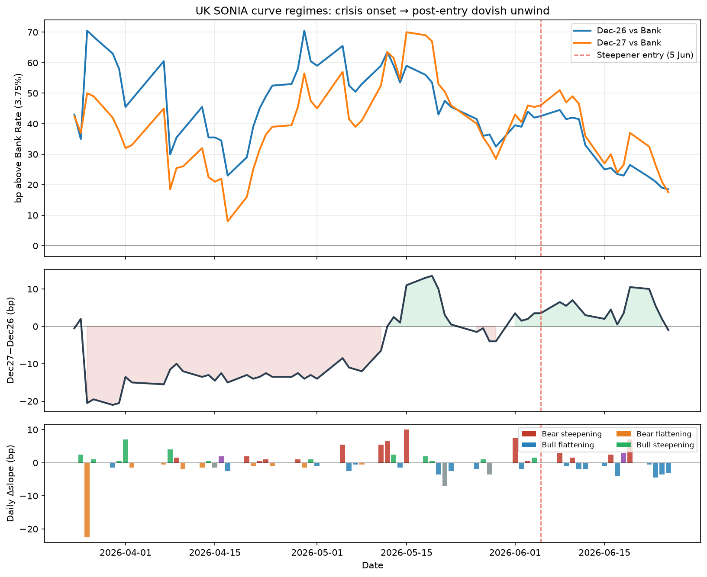

# Mea culpa: two curve regimes and why the steepener was right on anatomy, wrong on the modal path

*Follow-up to [UK SONIA Dec27−Dec26: Front-Loaded Hike Pricing and the Calendar Steepener](uk-sonia-front-loaded-hike-pricing.md). Data through 25 Jun 2026 EOD (Barchart ICE 1M SONIA).*

On 5 June I put on **long JUZ26 / short JUZ27** at **Dec27−Dec26 = +3.5 bp**, arguing that front-loaded hike pricing (+42.5 bp in Dec-26, only +3.5 bp in the belly increment) was inconsistent with BoE Scenarios A/B and the disinflationary macro flow. The *anatomy* of that argument still looks correct. What I underweighted was **which regime would dominate day-to-day** once the belly had already partly uninverted — and that turns out to matter more for P&L than being directionally right on the unwind thesis.

---

## What actually happened

Since entry the **modal path has been dovish repricing of the front end**, and that has coincided with **bull flattening** on the Dec27−Dec26 spread — the opposite of what a long-calendar steepener needs.

| | **At entry (5 Jun)** | **Latest (25 Jun)** | **Change** |
|---|---:|---:|---:|
| Dec-26 implied | 4.175% | 3.935% | **−24.0 bp** |
| Dec-27 implied | 4.210% | 3.925% | **−28.5 bp** |
| Dec27−Dec26 slope | **+3.5 bp** | **−1.0 bp** | **−4.5 bp** |
| Dec-26 vs Bank (3.75%) | +42.5 bp | +18.5 bp | −24.0 bp |

The front end repriced lower — as the thesis expected — but **Dec-26 fell less than Dec-27 on net** (bull flattening), so the calendar steepener lost on the slope leg even while the outright long Dec-26 would have made **+23.5 bp**.

---

## Two regimes, not one trade

The sample from the Middle East shock through late June splits cleanly into two phases. Regimes are classified from daily implied-rate changes (0.25 bp tolerance on slope), using the same taxonomy as the SONIA dashboard (`bear_steepening`, `bull_flattening`, etc.).

| Period | Days | **Modal day-type** | Bull flattening | Bear steepening | Σ ΔDec26 | Σ Δslope | Steepener P&L | Long Dec26 P&L |
|---|---:|---|---:|---:|---:|---:|---:|---:|
| **Crisis onset** (24 Mar – 4 Jun) | 48 | Bull steepening | 21% | 23% | −1.0 bp | **+4.0 bp** | **+4.0 bp** | +1.0 bp |
| **Post-entry** (5 Jun – 25 Jun) | 15 | **Bull flattening** | **60%** | 27% | −23.5 bp | **−4.5 bp** | **−4.5 bp** | **+23.5 bp** |
| Full sample | 63 | Bull flattening | 30% | 24% | −24.5 bp | −0.5 bp | −0.5 bp | +24.5 bp |

**Crisis onset:** At the start of the shock (24 Mar) the Dec27−Dec26 belly was **slightly inverted** (−0.5 bp) while the Jun-27 hump sat **+18 bp** above Dec-26 — a compressed, front-loaded belly. Through early June the modal day-type was **bull steepening** (both legs rallying, back faster). A steepener would have scraped **+4 bp** — modest, but positive.

**Post-entry:** By the time I entered, the belly had already uninverted to +3.5 bp. From there the modal path flipped to **bull flattening** (60% of sessions). Dovish days dominated (10 of 15), and on those days **90%** were classified as bull flattening. The steepener gave back the crisis-onset gain and then some.

So the user's mental model is **mostly right**, with one nuance: the crisis-onset regime was **bull steepening**, not bear steepening — both legs were often rallying together as the belly re-steepened from inversion. The steepener worked a little, but the *big* move came after entry, when the modal regime changed character.



*Figure 1. Top: Dec-26 and Dec-27 priced vs Bank Rate (3.75%). Middle: Dec27−Dec26 slope level. Bottom: daily Δslope coloured by regime. Red dashed line: steepener entry (5 Jun 2026). Rebuild: `python3 build_curve_regime_mea_culpa.py`.*

---

## Hawk days vs dovish days: is bear steepening the hedge?

**Partly true — but not enough to carry the position.**

Conditional on Dec-26 **selling off** (hawkish day, ΔDec26 > +0.25 bp):

| Sub-sample | Hawk days | Bear steepening share | Bear flattening share | Mean Δslope |
|---|---:|---:|---:|---:|
| Full sample (Mar–Jun) | 28 | **54%** | 32% | +0.46 bp |
| Post-entry only | 5 | **80%** | 0% | — |

Conditional on Dec-26 **rallying** (dovish day, ΔDec26 < −0.25 bp):

| Sub-sample | Dov days | Bull flattening share | Bull steepening share | Mean Δslope |
|---|---:|---:|---:|---:|
| Full sample | 34 | **56%** | 35% | −0.35 bp |
| Post-entry only | 10 | **90%** | 0% | — |

So yes: **when Dec-26 sells off, bear steepening is the plurality** (and was overwhelming in the five hawkish post-entry sessions, including 19 Jun). But hawk days were **rare** after entry (5 of 15), while dovish sessions were the bulk of the move.

Post-entry P&L decomposition:

| Day type | Days | Steepener (Δslope) | Long Dec-26 |
|---|---:|---:|---:|
| Hawk (Dec-26 up) | 5 | **+14.0 bp** | −7.0 bp |
| Dov (Dec-26 down) | 10 | **−18.5 bp** | **+30.5 bp** |

The steepener **did** work on hawk tails — but the dovish modal path overwhelmed it. 19 June was the textbook bear-steepening day (+7 bp on the spread in one session); it was not representative of the average session since entry.

---

## Is there a two-sided calendar spread that wins both ways?

**Not cleanly, without regime timing.**

| Expression | Wins when… | Post-entry result | Problem |
|---|---|---:|---|
| **Long Dec26 / Short Dec27** (steepener) | Hawkish shock, belly compresses, bear steepening | −4.5 bp | Modal path was dovish + bull flattening |
| **Long Dec26 outright** | Dovish unwind, front-end cuts priced out | **+23.5 bp** | Loses on hawk days (−7 bp cum on 5 sessions) |
| **Short Dec26 / Long Dec27** (flattener) | Dovish + bull flattening | +4.5 bp | Loses on hawk tails (+14 bp against on steepener metric) |

There is no single calendar spread that dominates **both** regimes. You are effectively choosing:

1. **Crisis / hawk regime** — belly compression, bear steepening → steepener
2. **Unwind / dov regime** — front-end rally, bull flattening → outright long front or flattener

The original trade was a bet on regime (2) with a hedge for regime (1). Regime (2) arrived as expected on levels, but its **daily curve shape** (bull flattening, not bull steepening) was wrong for the expression. Regime (1) showed up too rarely, and only in concentrated bursts.

---

## What I would keep vs change

**Keep:**

- The pricing anatomy was extreme: 92% of hikes through Dec-27 were in Dec-26 at entry.
- Macro and BoE messaging (Scenarios A/B, active hold) pointed to unwind, not Scenario C.
- Belly compression *can* happen on hawk days — 19 Jun proved it.

**Change:**

- **Regime conditioning matters more than static cheapness.** A +3.5 bp belly is cheap versus a +42.5 bp front, but once uninverted the marginal day-type was flattening, not steepening.
- **Betas are regime-split, not constant.** Full-sample Dec-27 β ≈ 0.86 vs Dec-26; on hawk days β drops toward ~0.4 — not the “back sells off faster” hedge the trade needed on average.
- **The “hedge” and the “view” were in tension.** The view (dovish unwind) required bull steepening or at least parallel shifts; the hedge (bear steepening on hawk days) only pays on the minority of sessions.

---

## Reproduce

```bash
python3 build_curve_regime_mea_culpa.py   # → data/curve_regime_summary.json, charts/curve_regime_mea_culpa.png
python3 analyze_sonia_regimes.py          # hawk/dov threshold scans, full contract corr matrix
```

---

*Internal research note. Not investment advice. SONIA: Barchart ICE EOD; policy anchor: BoE Bank Rate 3.75%.*
